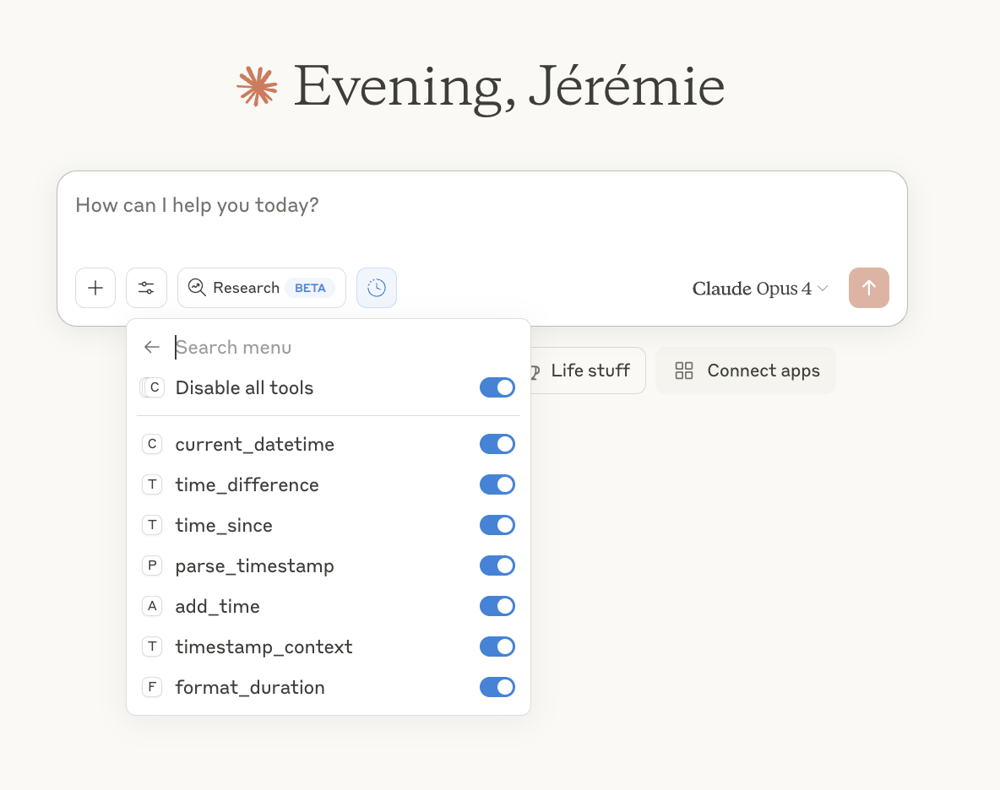
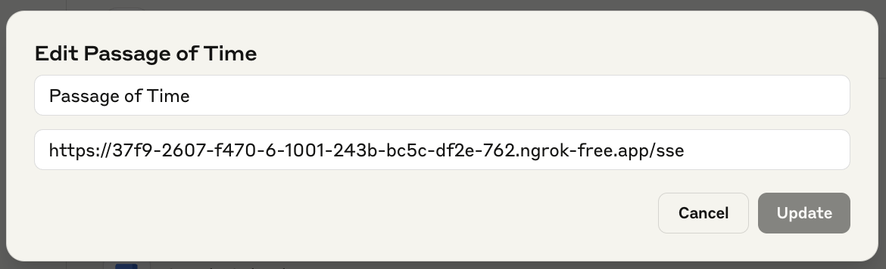

# "Passage of Time" Model Context Protocol (MCP) Server 🕐

An MCP server that gives language models temporal awareness and time calculation abilities. Teaching LLMs the significance of the passage of time through collaborative tool development.



## 📖 The Story

This project emerged from a philosophical question: "Can AI perceive the passage of time?" What started as an exploration of machine consciousness became a practical solution to a real problem - LLMs can't reliably calculate time differences.

Instead of publishing a paper about how "silly" these models are at mental math, we decided to do what we've done for ourselves: **equip them with a calculator for time**.

Through human-LLM collaboration, we discovered that with proper temporal tools, models can uncover surprising insights about conversation patterns, work rhythms, and the human experience of time.

[Read the full story on Medium →](https://medium.com/@jeremie.lumbroso/teaching-ai-the-significance-of-the-passage-of-time-yes-that-one-106ad7d20957)

## 🚀 Quick Start

### Prerequisites

- Python 3.12+
- pipenv (or pip)
- An MCP-compatible client (Claude.ai, Continue.dev, etc.)

### Installation

1. Clone the repository:
```bash
git clone https://github.com/jlumbroso/passage-of-time-mcp.git
cd passage-of-time-mcp
```

2. Install dependencies:
```bash
pipenv install
# or with pip:
pip install fastmcp pytz
```

3. Run the server:
```bash
pipenv run server
# or directly:
pipenv run python passage_of_time_mcp.py
```

The server will start on `http://0.0.0.0:8000/sse`.

### Connecting to Claude.ai

1. In Claude.ai, go to Settings → Integrations
2. Click "Add integration" and select "Custom"
3. Enter the server URL (e.g., `https://your-server.ngrok-free.app/sse` if using ngrok, make sure to add `/sse` at the end)
4. Save and enable all the time-related tools

> **Note**: For local development, you'll need to expose your server using ngrok or deploy it to a public URL.

## 🛠️ Available Tools

### Core Functions

#### `current_datetime(timezone="America/New_York")`
Returns the current date and time. The foundation of temporal awareness.

```
Returns: "2024-01-15 14:30:45 EST"
```

#### `time_difference(timestamp1, timestamp2, unit="auto")`
Calculates the duration between two timestamps with human-readable output.

```python
# Example response:
{
    "seconds": 11401,
    "formatted": "3 hours, 10 minutes, 1 second",
    "requested_unit": 3.17,  # if unit="hours"
    "is_negative": false
}
```

#### `timestamp_context(timestamp)`
Provides human context about a timestamp - is it weekend? Business hours? Dinner time?

```python
# Example response:
{
    "time_of_day": "evening",
    "day_of_week": "Saturday", 
    "is_weekend": true,
    "is_business_hours": false,
    "typical_activity": "leisure_time",
    "relative_day": "today"
}
```

#### `time_since(timestamp)`
Calculates how long ago something happened with contextual descriptions.

```python
# Example response:
{
    "seconds": 7200,
    "formatted": "2 hours ago",
    "context": "earlier today"
}
```

#### `parse_timestamp(timestamp)`
Converts timestamps between different formats for maximum compatibility.

```python
# Example response:
{
    "iso": "2024-01-15T14:30:45-05:00",
    "unix": "1705343445",
    "human": "January 15, 2024 at 2:30 PM EST",
    "day_of_week": "Monday"
}
```

#### `add_time(timestamp, duration, unit)`
Adds or subtracts time with natural language descriptions.

```python
# Example response:
{
    "result": "2024-01-16 14:30:45",
    "iso": "2024-01-16T14:30:45-05:00",
    "description": "tomorrow at 2:30 PM"
}
```

#### `format_duration(seconds, style="full")`
Formats durations in various styles for different contexts.

```python
# style="full": "2 hours, 30 minutes, 15 seconds"
# style="compact": "2h 30m 15s"
# style="minimal": "2:30:15"
```

## 💡 Example Conversations

### Basic Time Awareness
```
Human: What time is it?
Claude: [calls current_datetime] It's currently 3:45 PM EST on Monday, January 15, 2024.
```

### Conversation Rhythm Analysis
```
Human: Let's have a discussion about AI consciousness.
Claude: [calls current_datetime at start of each response]
[After several exchanges]
Human: What patterns do you notice in our conversation?
Claude: Looking at the timestamps, I notice you're taking 30 seconds to 2 minutes between responses, suggesting active engagement. The 3-minute pause before your question about implementation shows deeper consideration...
```

### Understanding Work Context
```
Human: [at 11:45 PM] Can you help me debug this code?
Claude: [calls current_datetime, then timestamp_context] 
I see it's late night on a weekday. Given that it's approaching midnight, let me help you efficiently so you can get some rest. Here's a focused debugging approach...
```

## 🏗️ Design Philosophy

This server embodies several key principles:

1. **Cognitive Partnership**: We treat LLMs as cognitive partners who need proper tools, not black boxes to be dressed up.

2. **Collaborative Design**: The tool suite emerged from asking Claude what they needed, not imposing our assumptions.

3. **Human Context Matters**: Time isn't just numbers - it's about understanding human rhythms, work patterns, and social contexts.

4. **Practical Over Perfect**: We provide the tools models actually need, tested through real conversations.

## 🔧 Configuration

### Timezone Support
The server defaults to `America/New_York` but supports all standard timezone names:
- `UTC`
- `US/Pacific` 
- `Europe/London`
- `Asia/Tokyo`
- etc.

### Timestamp Formats
All timestamps must use one of these formats:
- Full: `YYYY-MM-DD HH:MM:SS` (e.g., "2024-01-15 14:30:45")
- Date only: `YYYY-MM-DD` (e.g., "2024-01-15")

This strict formatting prevents ambiguity and ensures reliable calculations.

## 🚧 Known Issues & Future Work

### Current Limitations
- The SSE transport is deprecated but currently most reliable
- Server requires public URL for web-based clients
- No persistent memory of past time calculations

### Roadmap
- [ ] Migrate to modern `http-stream` transport
- [ ] Add Docker support for easier deployment
- [ ] Create browser extension for local development
- [ ] Add configurable activity patterns per user
- [ ] Support for calendar integration
- [ ] Natural language time parsing ("next Tuesday", "in 3 hours")

## 🤝 Contributing

This project emerged from human-LLM collaboration and welcomes more of the same! Whether you're contributing solo or with AI assistance, we value:

1. **Practical additions** - Tools that solve real temporal understanding problems
2. **Human context** - Features that help models understand how humans experience time
3. **Clear documentation** - Examples that show real-world usage

### Development Setup

First, clone the repository:

```bash
git clone https://github.com/jlumbroso/passage-of-time-mcp.git
cd passage-of-time-mcp
```

Then, install dependencies (I am using `pipenv` because it simultaneously creates a virtual environment and installs package, but any pip-compatible tool will work):

```bash
# Install dev dependencies
pipenv install --dev

# Run tests
pipenv run test

# Run server
pipenv run server
```

This will start the server on `http://0.0.0.0:8000/sse` on your local computer. However, for web-based clients to connect to it, you will need to expose it to the internet using a service like [ngrok](https://ngrok.com/). 

Assuming you have ngrok installed, you can run `ngrok http 8000` to expose the server to the internet, and then use the provided URL in your MCP client. By default, ngrok will provide the endpoint to use in the form of `https://<random-subdomain>.ngrok-free.app/` in the Terminal:

```bash
❤️ ngrok? We're hiring https://ngrok.com/careers

Session Status                online
Account                       Jérémie Lumbroso (Plan: Free)
Update                        update available (version 3.23.1, Ctrl-U to update)
Version                       3.22.1
Region                        United States (us)
Latency                       31ms
Latency                       1575ms
Web Interface                 http://127.0.0.1:4040
Forwarding                    https://37f9-2607-f470-6-1001-243b-bc5c-df2e-762.ngrok-free.app ->

Connections                   ttl     opn     rt1     rt5     p50     p90
                              1756    0       0.01    0.03    5.32    61.51

HTTP Requests
-------------

00:06:44.030 EDT POST /messages/                202 Accepted
00:06:43.936 EDT POST /messages/                202 Accepted
00:06:43.514 EDT GET  /sse                      200 OK
00:06:43.682 EDT POST /messages/                202 Accepted
00:06:43.342 EDT POST /sse                      405 Method Not Allowed
```

In my case, I used `https://37f9-2607-f470-6-1001-243b-bc5c-df2e-762.ngrok-free.app`, but since we are using the "SSE" transport method, the endpoint will have `/sse` appended at the end, so the final URL will be `https://37f9-2607-f470-6-1001-243b-bc5c-df2e-762.ngrok-free.app/sse`.

Once this endpoint exists, you can add the MCP server as an integration to LLMs, such as Claude, following these instructions:



Once you've connected the MCP server to Claude.ai, you should start receiving queries locally:

```bash
$ pipenv run server 
/Users/jlumbroso/.asdf/installs/python/3.12.4/lib/python3.12/asyncio/events.py:88: DeprecationWarning: The run_sse_async method is deprecated (as of 2.3.2). Use run_http_async for a modern (non-SSE) alternative, or create an SSE app with `fastmcp.server.http.create_sse_app` and run it directly.
  self._context.run(self._callback, *self._args)
[06/16/25 19:18:04] INFO     Starting MCP server 'Passage of Time' with transport 'sse' on http://0.0.0.0:8000/sse            server.py:1219
INFO:     Started server process [11373]
INFO:     Waiting for application startup.
INFO:     Application startup complete.
INFO:     Uvicorn running on http://0.0.0.0:8000 (Press CTRL+C to quit)
INFO:     34.162.142.92:0 - "POST /sse HTTP/1.1" 405 Method Not Allowed
INFO:     34.162.142.92:0 - "GET /sse HTTP/1.1" 200 OK
INFO:     34.162.142.92:0 - "POST /messages/?session_id=e21108cecbf646ffb7effe14dd856b3d HTTP/1.1" 202 Accepted
INFO:     34.162.142.92:0 - "POST /messages/?session_id=e21108cecbf646ffb7effe14dd856b3d HTTP/1.1" 202 Accepted
INFO:     34.162.142.92:0 - "POST /messages/?session_id=e21108cecbf646ffb7effe14dd856b3d HTTP/1.1" 202 Accepted
INFO:     34.162.142.92:0 - "POST /messages/?session_id=e21108cecbf646ffb7effe14dd856b3d HTTP/1.1" 202 Accepted
INFO:     34.162.142.92:0 - "POST /messages/?session_id=e21108cecbf646ffb7effe14dd856b3d HTTP/1.1" 202 Accepted
INFO:     34.162.142.92:0 - "POST /messages/?session_id=e21108cecbf646ffb7effe14dd856b3d HTTP/1.1" 202 Accepted
```

Eventually, you will want to deploy this MCP server to a cloud provider such as Render.com, so your LLM doesn't have to contend with the unreliable nature of your local machine.

## 📝 License

Mozilla Public License 2.0 - because good ideas should spread while staying open.

## 🙏 Acknowledgments

- Created through extended collaboration between [Jérémie Lumbroso](https://github.com/jlumbroso) and Claude Opus 4.0 (Anthropic)
- Inspired by the question: "Can AI perceive the passage of time?"
- Built on [FastMCP](https://github.com/fastmcp/fastmcp) framework
- Special thanks to the [Natural and Artificial Minds initiative](https://nam.ai.princeton.edu/) at Princeton University

## 📚 Further Reading

- [Teaching AI "The Significance of the Passage of Time" - Medium Article](https://medium.com/@jeremie.lumbroso/teaching-ai-the-significance-of-the-passage-of-time-yes-that-one-106ad7d20957)
- [We Can't Understand AI Using our Existing Vocabulary - Been Kim et al.](https://arxiv.org/abs/2502.07586)
- [Model Context Protocol Documentation](https://modelcontextprotocol.io)

---

*"We're not just building better LLM tools. We're teaching curious cognitive systems about what it means to be human—one timestamp at a time."*
